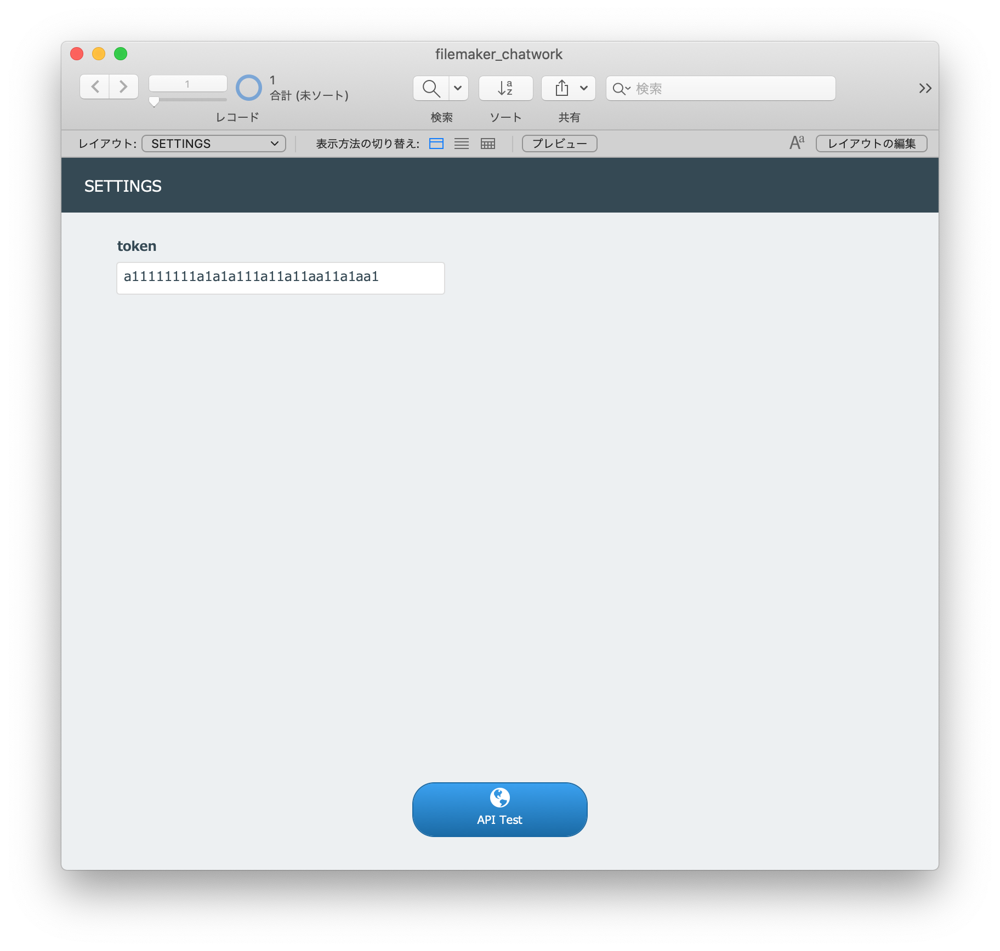
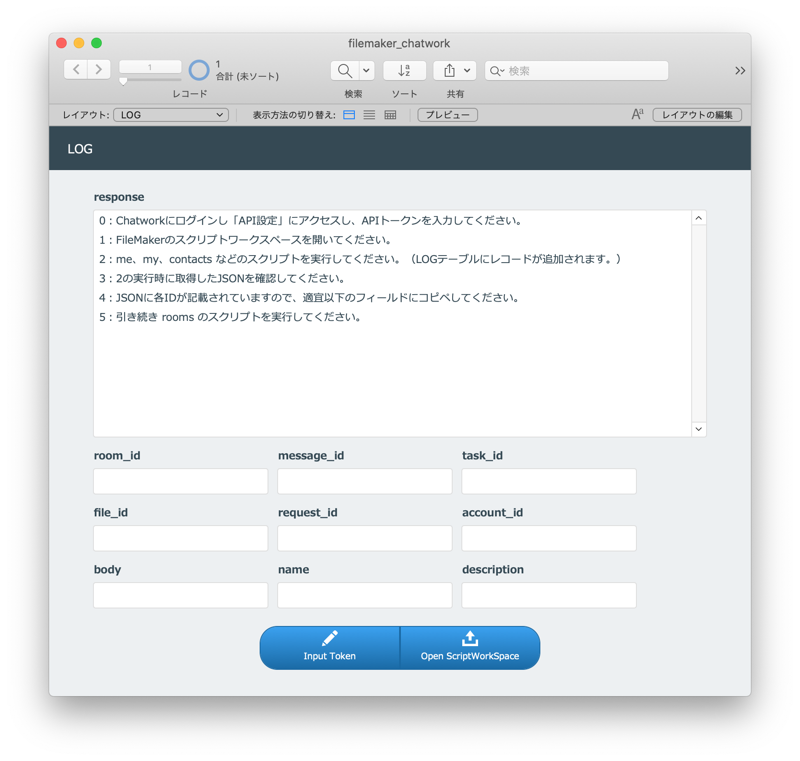
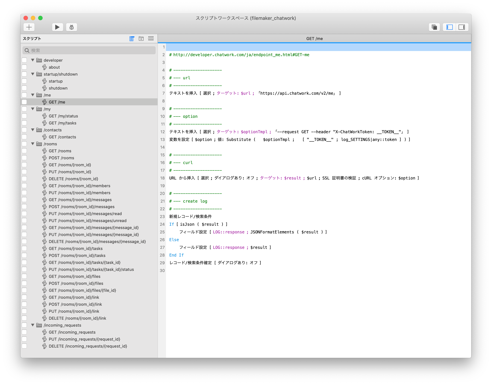

# filemaker-chatwork

FileMakerの「URLから挿入」を使い、Chatworkの全てのAPIをリクエストするためのサンプルファイルです。

---

# スクリーンショット

## settings



## log



## scriptworkspace



## script（GET /me）

```
# http://developer.chatwork.com/ja/endpoint_me.html#GET-me

# --------------------
# --- url
# --------------------
テキストを挿入 [ 選択 ; ターゲット: $url ; 「https://api.chatwork.com/v2/me」 ] 

# --------------------
# --- option
# --------------------
テキストを挿入 [ 選択 ; ターゲット: $optionTmpl ; 「--request GET --header "X-ChatWorkToken: __TOKEN__"」 ] 
変数を設定 [ $option ; 値: Substitute (   $optionTmpl ;   [ "__TOKEN__" ; log_SETTINGS|any::token ] ) ] 

# --------------------
# --- curl
# --------------------
URL から挿入 [ 選択 ; ダイアログあり: オフ ; ターゲット: $result ; $url ; SSL 証明書の検証 ; cURL オプション: $option ] 

# --------------------
# --- create log
# --------------------
新規レコード/検索条件
If [ isJson ( $result ) ] 
	フィールド設定 [ LOG::response ; JSONFormatElements ( $result ) ] 
Else
	フィールド設定 [ LOG::response ; $result ] 
End If
レコード/検索条件確定 [ ダイアログあり: オフ ] 
```

# Author

frudens Inc. <https://frudens.com>

# License

This software is distributed under the
[Apache License, Version 2.0](http://www.apache.org/licenses/LICENSE-2.0),
see LICENSE.txt for more information.

